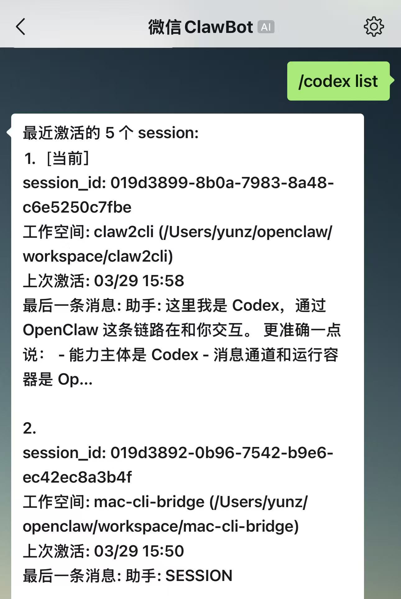
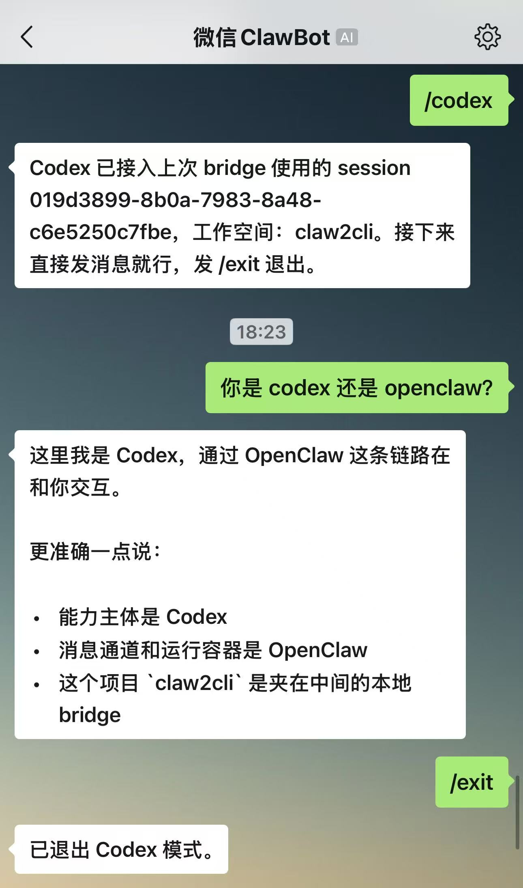

# claw2cli

用于微信里的 Codex 本地 CLI bridge。

English README: [`README.en.md`](./README.en.md).

## 这是什么

`claw2cli` 让你可以在 macOS 上通过微信使用 Codex。它保留 OpenClaw 的消息链路，只把 `/codex` 命令转给本地 CLI 会话。

这个项目不是独立软件，必须先安装 OpenClaw 和微信通道插件。

## 预览图

<p align="center">
  
  
</p>

<p align="center">
  <sub>微信端 <code>/codex list</code> 和 session 接管预览</sub>
</p>

## 能做什么

- 从微信直接进入 Codex session
- 列出 Mac 上最近的 Codex session
- 回到同一个微信会话上次使用的 session
- 通过编号切换 session 并继续对话
- 切换前展示清晰的 session 预览

## 使用前提

- 已在 OpenClaw `2026.3.12 (6472949)` 上验证
- 已在 `@tencent-weixin/openclaw-weixin` `1.0.2` 上验证
- 本机需要可用的 `openclaw` CLI
- 需要先安装并登录微信通道，`/codex` 才能工作
- 微信插件需要把 `/codex` 处理转交给 `claw2cli`

## 怎么用

### 1. 启动 bridge

```bash
cd /path/to/claw2cli
npm start
```

### 2. 在微信里发送 `/codex`

如果这个微信会话之前已经用过 session，它会自动回到上次那一个；如果没有，它会先展示最近 session 列表。

### 3. 选择 session 或继续对话

```text
/codex list
/codex 2
/codex 2 帮我继续刚才那个排查
```

## 微信侧适配

`openclaw-weixin` 只负责通道层能力，比如登录、消息收发和模式切换；`/codex` 的 session 策略由 `claw2cli` 统一负责。

如果你是从一个干净的 OpenClaw 微信环境接入，请按 [`WEIXIN_PLUGIN_PATCH.md`](./WEIXIN_PLUGIN_PATCH.md) 里的插件侧改动处理。

> 如果不知道如何适配，让 codex 帮忙改一下 🤣

## 运行要求

- macOS
- Node.js 18+
- Codex CLI
- 已安装并启用 OpenClaw 微信通道

## 更多细节

技术细节见 [`TECHNICAL.md`](./TECHNICAL.md)。
